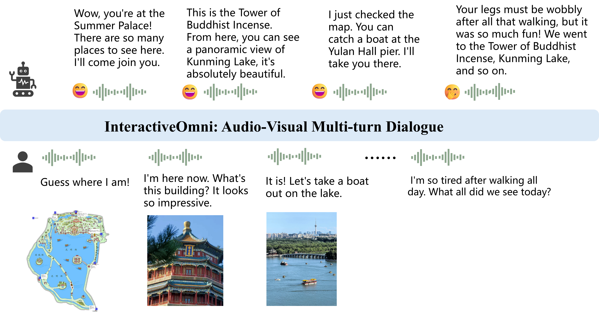
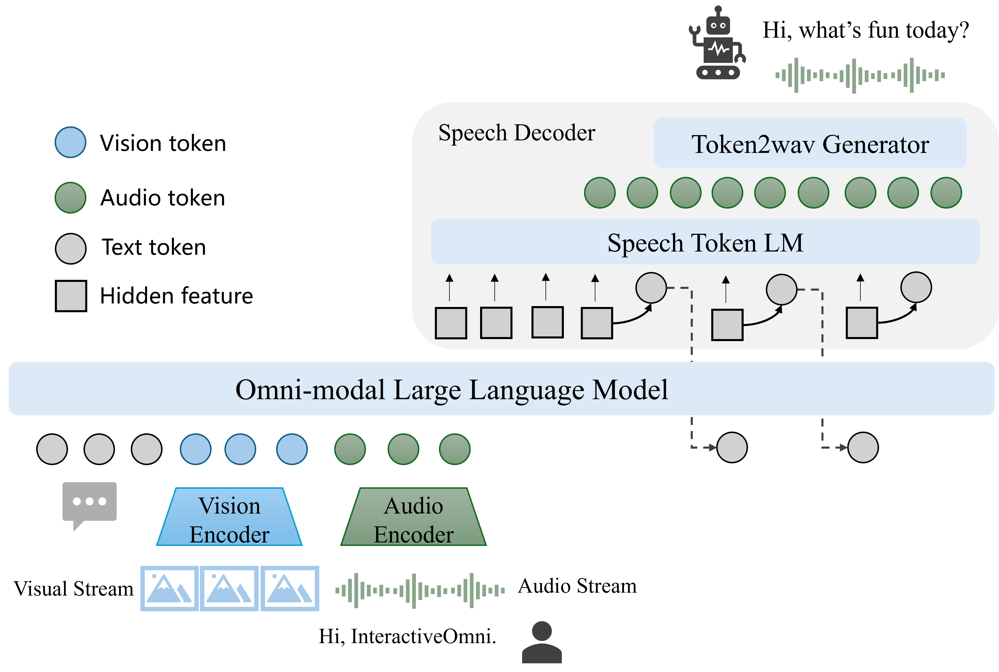
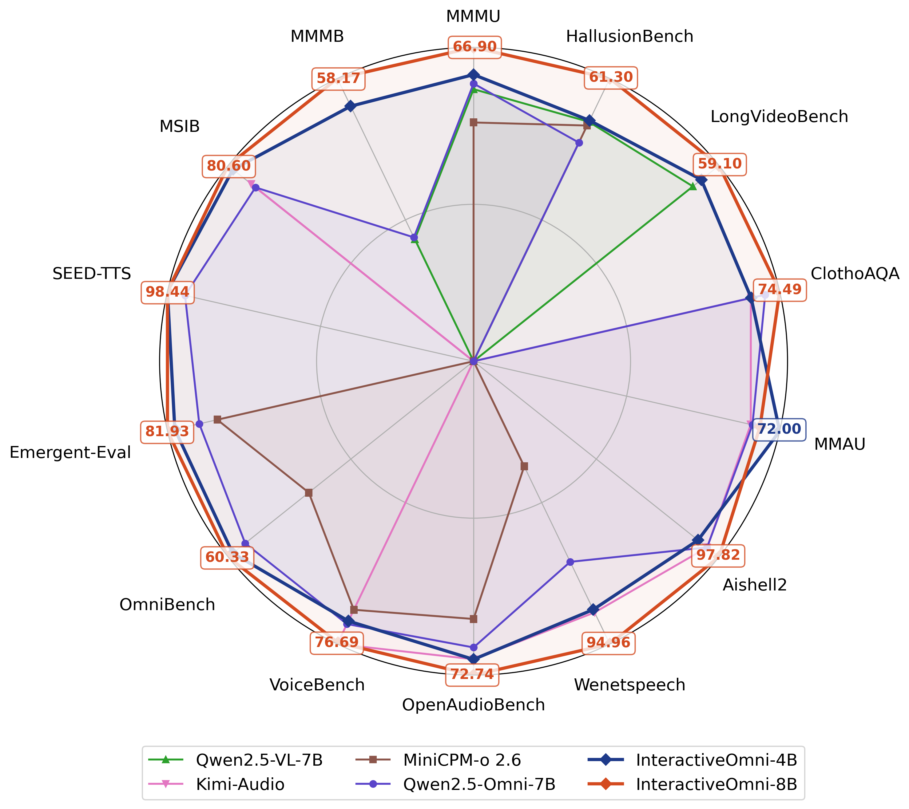

# InteractiveOmni

<p align="center">
InteractiveOmni-4B <a href="https://huggingface.co/sensefvg/InteractiveOmni-4B">🤗</a>&nbsp; | InteractiveOmni-8B <a href="https://huggingface.co/sensefvg/InteractiveOmni-8B">🤗</a>&nbsp; | 📑 <a href="https://arxiv.org/pdf/xxx">Paper</a> &nbsp;&nbsp;
</p>

## News
* 2025.09.xx: 👋 We release the inference code and model weights of [InteractiveOmni-4B](https://huggingface.co/sensefvg/InteractiveOmni-4B) and [InteractiveOmni-8B](https://huggingface.co/sensefvg/InteractiveOmni-8B).
* 2025.09.xx: 👋 We release the technical report of [InteractiveOmni](https://arxiv.org/pdf/xxx).

## Contents

- [Introduction](#overview)
- [QuickStart](#quickstart)
- [Evaluation](#evaluation)
- [Acknowledgements](#acknowledgements)
- [Citation](#citation)


## Introduction
InteractiveOmni is a unified omni-modal model that can simultaneously receive inputs such as images, audio, text, and
video and directly generate coherent text and speech streams, achieving truly integrated interaction.

This is the schematic diagram for multi-turn audio-visual interaction.
<p align="center">
    
<p>

### Key Features
* **Strong Performance Across Modalities:**  Exhibiting omni-modal understanding and speech generation capabilities. InteractiveOmni outperforms the similarly sized vision-language models, audio-language models and omni-modal models.
* **State-of-the-Art Performance:** Achieve SOTA results on various open-source benchmarks for image, audio, and video understanding, as well as speech conversation.
* **Excellent Interactive Performance:** Achieve more intelligent audio-visual experience with multi-turn and long-term memory capabilities.
* **Multi-turn Interactive Benchmarks:** Propose multi-modal multi-turn benchmark to evaluate multi-turn memory and speech interaction of leading MLLMs.
* **On-device Model:**  the 4B model achieves 97% of the performance with just 50% of the model size compared with 8B model.
### Model Architecture
<p align="center">
    
<p>


## Quickstart
### Get the Code
```bash
git clone https://github.com/SenseTime-FVG/InteractiveOmni.git
cd InteractiveOmni
pip install -r requirements.txt
```

We provide an example code to run `InteractiveOmni` using 🤗 `Transformers`.

> Please use transformers>=4.51.0 and FlashAttention2 to ensure the model works normally.
### Model Loading
```python
import torch
from transformers import AutoTokenizer, AutoModel
path = "sensefvg/InteractiveOmni-8B"
model = AutoModel.from_pretrained(
    path,
    torch_dtype=torch.bfloat16,
    trust_remote_code=True).eval().cuda()
```

### Inference with Transformers

```python
import torch
from transformers import AutoModel, AutoTokenizer
import torchaudio

path = "sensefvg/InteractiveOmni-8B"
model = AutoModel.from_pretrained(
    path,
    torch_dtype=torch.bfloat16,
    trust_remote_code=True).eval().cuda()
tokenizer = AutoTokenizer.from_pretrained(path, trust_remote_code=True, use_fast=True)

# set the max number of tiles in `max_num`
max_num = 12
frame = 8
generation_config = dict(max_new_tokens=1024, do_sample=True)

# pure-text conversation (纯文本对话)
messages = [
    {
        'role': "user",
        'content': 'Hello, who are you?',
    }
]
response = model.chat(tokenizer, generation_config, messages)

# audio conversation (音频对话)
messages = [
    {
        'role': "user",
        'content': [
            {
                "type": "audio",
                "audio": "assets/hello_en.wav"
            }
        ]
    }
]
response = model.chat(tokenizer, generation_config, messages)

## Generate both audio and text output
messages = [
    {
        'role': "user",
        'content': [
            {
                "type": "audio",
                "audio": "assets/hello_zh.wav"
            }
        ]
    }
]
response, wav_response = model.chat(tokenizer, generation_config, messages, generate_audio=True)
torchaudio.save("result.wav", wav_response.cpu(), 24000, format="wav")

# image-text conversation (图文对话)
messages = [
    {
        'role': "user",
        'content': [
            {
                "type": "image",
                "image": 'assets/cat_cup.jpeg'
            },
            {
                "type": "text",
                "text": "Please describe the image shortly."
            }
        ]
    }
]
response = model.chat(tokenizer, generation_config, messages, max_num)

# image-audio conversation (图音对话)
messages = [
    {
        'role': "user",
        'content': [
            {
                "type": "image",
                "image": 'assets/cat_cup.jpeg'
            },
            {
                "type": "audio",
                "audio": "assets/describe_img_en.wav"
            }
        ]
    }
]
response = model.chat(tokenizer, generation_config, messages, max_num)

## image-audio conversation, generate both audio and text output
messages = [
    {
        'role': "user",
        'content': [
            {
                "type": "image",
                "image": 'assets/cat_cup.jpeg'
            },
            {
                "type": "audio",
                "audio": "assets/describe_img_en.wav"
            }
        ]
    }
]
response, wav_response = model.chat(tokenizer, generation_config, messages, generate_audio=True)
torchaudio.save("result.wav", wav_response.cpu(), 24000, format="wav")

# video conversation (视频对话)
messages = [
    {
        'role': "user",
        'content': [
            {
                "type": "video",
                "video": 'video_path'
            },
            {
                "type": "text",
                "text": "Describe this video in detail."
            }
        ]
    }
]
response = model.chat(tokenizer, generation_config, messages, max_num, frame)
```

### Use audio output
* If users need audio output, the system prompt must be set as follows, otherwise the audio output may not work as expected.
```
You are a highly advanced multimodal conversational AI designed for human-like interaction. You can perceive auditory, visual, speech, and textual inputs, and generate text and speech.
```
```python
messages = [
    {
        "role": "system",
        "content": "You are a highly advanced multimodal conversational AI designed for human-like interaction. You can perceive auditory, visual, speech, and textual inputs, and generate text and speech."
    },
    {
        'role': "user",
        'content': [
            {
                "type": "audio",
                "audio": "assets/hello_zh.wav",
            }
        ]
    }
]
response, wav_response = model.chat(tokenizer, generation_config, messages, generate_audio=True)
torchaudio.save("result_none_speaker.wav", wav_response.cpu(), 24000, format="wav")
```
* Use default speaker to generate output audio.
```python
messages = [
    {
        "role": "system",
        "content": "You are a highly advanced multimodal conversational AI designed for human-like interaction. You can perceive auditory, visual, speech, and textual inputs, and generate text and speech."
    },
    {
        'role': "user",
        'content': [
            {
                "type": "audio",
                "audio": "assets/hello_zh.wav",
            }
        ]
    }
]
response, wav_response = model.chat(tokenizer, generation_config, messages, generate_audio=True, speaker_embedding=model.default_speaker_embedding)
torchaudio.save("result_default_speaker.wav", wav_response.cpu(), 24000, format="wav")
```
* Use custom speaker to generate output audio, similar to sound cloning.
```python
messages = [
    {
        "role": "system",
        "content": "You are a highly advanced multimodal conversational AI designed for human-like interaction. You can perceive auditory, visual, speech, and textual inputs, and generate text and speech."
    },
    {
        'role': "user",
        'content': [
            {
                "type": "audio",
                "audio": "assets/hello_zh.wav",
            }
        ]
    }
]
speaker_embedding = model.extract_speaker_embedding("assets/hello_zh.wav")
response, wav_response = model.chat(tokenizer, generation_config, messages, generate_audio=True, speaker_embedding=speaker_embedding)
torchaudio.save("result_custom_speaker.wav", wav_response.cpu(), 24000, format="wav")
```

## Evaluation
InteractiveOmni achieves state-of-the-art performance across a wide range of multi-modal understanding and speech generation benchmarks. 
<p align="center">
    
<p>

<details>
<summary>Image Understanding</summary>

<table style="width:100%; border-collapse: collapse;">
  <thead>
    <tr style="border-bottom: 1px solid black;">
      <th align="left" style="padding: 8px;">Model</th>
      <th align="center" style="padding: 8px;">MMBench</th>
      <th align="center" style="padding: 8px;">MMStar</th>
      <th align="center" style="padding: 8px;">MMMU</th>
      <th align="center" style="padding: 8px;">MathVista</th>
      <th align="center" style="padding: 8px;">HallusionBench</th>
      <th align="center" style="padding: 8px;">AI2D</th>
      <th align="center" style="padding: 8px;">OCRBench</th>
      <th align="center" style="padding: 8px;">Avg</th>
    </tr>
  </thead>
  <tbody>
    <tr>
      <td colspan="9" align="center" style="font-weight: bold; border-top: 1px solid #ddd; border-bottom: 1px solid black;">Vision-Language Model</td>
    </tr>
    <tr>
      <td align="left" style="padding: 8px;">InternVL3-8B</td>
      <td align="center" style="padding: 8px;">82.1</td>
      <td align="center" style="padding: 8px;">68.7</td>
      <td align="center" style="padding: 8px;">62.2</td>
      <td align="center" style="padding: 8px;">70.5</td>
      <td align="center" style="padding: 8px;">49.0</td>
      <td align="center" style="padding: 8px;">85.1</td>
      <td align="center" style="padding: 8px;">88.4</td>
      <td align="center" style="padding: 8px;">72.3</td>
    </tr>
    <tr>
      <td align="left" style="padding: 8px;">InternVL3.5-8B</td>
      <td align="center" style="padding: 8px;">79.5</td>
      <td align="center" style="padding: 8px;">69.3</td>
      <td align="center" style="padding: 8px;">73.4</td>
      <td align="center" style="padding: 8px;">78.4</td>
      <td align="center" style="padding: 8px;">54.5</td>
      <td align="center" style="padding: 8px;">84.0</td>
      <td align="center" style="padding: 8px;">84.0</td>
      <td align="center" style="padding: 8px;">74.7</td>
    </tr>
    <tr>
      <td align="left" style="padding: 8px;">Qwen2.5-VL-7B</td>
      <td align="center" style="padding: 8px;">82.2</td>
      <td align="center" style="padding: 8px;">64.1</td>
      <td align="center" style="padding: 8px;">58.0</td>
      <td align="center" style="padding: 8px;">68.1</td>
      <td align="center" style="padding: 8px;">51.9</td>
      <td align="center" style="padding: 8px;">84.3</td>
      <td align="center" style="padding: 8px;">88.8</td>
      <td align="center" style="padding: 8px;">71.1</td>
    </tr>
    <tr>
      <td colspan="9" align="center" style="font-weight: bold; border-top: 1px solid black; border-bottom: 1px solid black;">Omni Model</td>
    </tr>
    <tr>
      <td align="left" style="padding: 8px;">GPT-4o-mini</td>
      <td align="center" style="padding: 8px;">76.0</td>
      <td align="center" style="padding: 8px;">54.8</td>
      <td align="center" style="padding: 8px;">60.0</td>
      <td align="center" style="padding: 8px;">52.5</td>
      <td align="center" style="padding: 8px;">46.1</td>
      <td align="center" style="padding: 8px;">77.8</td>
      <td align="center" style="padding: 8px;">78.5</td>
      <td align="center" style="padding: 8px;">63.7</td>
    </tr>
    <tr>
      <td align="left" style="padding: 8px;">VITA-1.5</td>
      <td align="center" style="padding: 8px;">76.8</td>
      <td align="center" style="padding: 8px;">60.2</td>
      <td align="center" style="padding: 8px;">52.6</td>
      <td align="center" style="padding: 8px;">66.2</td>
      <td align="center" style="padding: 8px;">44.6</td>
      <td align="center" style="padding: 8px;">79.2</td>
      <td align="center" style="padding: 8px;">74.1</td>
      <td align="center" style="padding: 8px;">64.8</td>
    </tr>
    <tr>
      <td align="left" style="padding: 8px;">Ming-Lite-Omni</td>
      <td align="center" style="padding: 8px;">80.8</td>
      <td align="center" style="padding: 8px;">64.7</td>
      <td align="center" style="padding: 8px;">56.3</td>
      <td align="center" style="padding: 8px;">71.6</td>
      <td align="center" style="padding: 8px;">55.0</td>
      <td align="center" style="padding: 8px;">83.1</td>
      <td align="center" style="padding: 8px;">88.4</td>
      <td align="center" style="padding: 8px;">71.4</td>
    </tr>
    <tr>
      <td align="left" style="padding: 8px;">Qwen2.5-Omni-7B</td>
      <td align="center" style="padding: 8px;">81.3</td>
      <td align="center" style="padding: 8px;">64.0</td>
      <td align="center" style="padding: 8px;">59.2</td>
      <td align="center" style="padding: 8px;">67.9</td>
      <td align="center" style="padding: 8px;">47.4</td>
      <td align="center" style="padding: 8px;">83.2</td>
      <td align="center" style="padding: 8px;">83.4</td>
      <td align="center" style="padding: 8px;">69.5</td>
    </tr>
    <tr>
      <td align="left" style="padding: 8px;">InteractiveOmni-4B</td>
      <td align="center" style="padding: 8px;">78.9</td>
      <td align="center" style="padding: 8px;">62.6</td>
      <td align="center" style="padding: 8px;">61.1</td>
      <td align="center" style="padding: 8px;">61.7</td>
      <td align="center" style="padding: 8px;">52.2</td>
      <td align="center" style="padding: 8px;">83.8</td>
      <td align="center" style="padding: 8px;">80.0</td>
      <td align="center" style="padding: 8px;">68.6</td>
    </tr>
    <tr>
      <td align="left" style="padding: 8px;">InteractiveOmni-8B</td>
      <td align="center" style="padding: 8px;"><strong>81.4</strong></td>
      <td align="center" style="padding: 8px;"><strong>66.8</strong></td>
      <td align="center" style="padding: 8px;"><strong>66.9</strong></td>
      <td align="center" style="padding: 8px;">68.0</td>
      <td align="center" style="padding: 8px;"><strong>61.3</strong></td>
      <td align="center" style="padding: 8px;"><strong>84.3</strong></td>
      <td align="center" style="padding: 8px;">83.7</td>
      <td align="center" style="padding: 8px;"><strong>73.2</strong></td>
    </tr>
  </tbody>
</table>

</details>

<details>
<summary>Video Understanding</summary>

<table style="width:100%; border-collapse: collapse;">
  <thead>
    <tr style="border-bottom: 1px solid black;">
      <th align="left" style="padding: 8px;">Model</th>
      <th align="center" style="padding: 8px;">Video-MME<br>(wo sub)</th>
      <th align="center" style="padding: 8px;">Video-MME<br>(w sub)</th>
      <th align="center" style="padding: 8px;">MLVU<br>(M-Avg)</th>
      <th align="center" style="padding: 8px;">LongVideoBench<br>(val total)</th>
      <th align="center" style="padding: 8px;">Avg</th>
    </tr>
  </thead>
  <tbody>
    <tr>
      <td colspan="6" align="center" style="font-weight: bold; border-top: 1px solid #ddd; border-bottom: 1px solid black;">Vision-Language Model</td>
    </tr>
    <tr>
      <td align="left" style="padding: 8px;">InternVL3-8B</td>
      <td align="center" style="padding: 8px;"><strong>66.3</strong></td>
      <td align="center" style="padding: 8px;">68.9</td>
      <td align="center" style="padding: 8px;">71.4</td>
      <td align="center" style="padding: 8px;">58.8</td>
      <td align="center" style="padding: 8px;">66.4</td>
    </tr>
    <tr>
      <td align="left" style="padding: 8px;">InternVL3.5-8B</td>
      <td align="center" style="padding: 8px;">66.0</td>
      <td align="center" style="padding: 8px;">68.6</td>
      <td align="center" style="padding: 8px;">70.2</td>
      <td align="center" style="padding: 8px;">62.1</td>
      <td align="center" style="padding: 8px;">66.7</td>
    </tr>
    <tr>
      <td align="left" style="padding: 8px;">Qwen2.5-VL-7B</td>
      <td align="center" style="padding: 8px;">65.1</td>
      <td align="center" style="padding: 8px;">71.6</td>
      <td align="center" style="padding: 8px;">70.2</td>
      <td align="center" style="padding: 8px;">56.0</td>
      <td align="center" style="padding: 8px;">64.5</td>
    </tr>
    <tr>
      <td colspan="6" align="center" style="font-weight: bold; border-top: 1px solid black; border-bottom: 1px solid black;">Omni Model</td>
    </tr>
    <tr>
      <td align="left" style="padding: 8px;">GPT-4o-mini</td>
      <td align="center" style="padding: 8px;">64.8</td>
      <td align="center" style="padding: 8px;">-</td>
      <td align="center" style="padding: 8px;">-</td>
      <td align="center" style="padding: 8px;">-</td>
      <td align="center" style="padding: 8px;">-</td>
    </tr>
    <tr>
      <td align="left" style="padding: 8px;">Qwen2.5-Omni-7B</td>
      <td align="center" style="padding: 8px;">64.3</td>
      <td align="center" style="padding: 8px;"><strong>72.4</strong></td>
      <td align="center" style="padding: 8px;">-</td>
      <td align="center" style="padding: 8px;">-</td>
      <td align="center" style="padding: 8px;">-</td>
    </tr>
    <tr>
      <td align="left" style="padding: 8px;">InteractiveOmni-4B</td>
      <td align="center" style="padding: 8px;">63.3</td>
      <td align="center" style="padding: 8px;">69.3</td>
      <td align="center" style="padding: 8px;">68.0</td>
      <td align="center" style="padding: 8px;">57.0</td>
      <td align="center" style="padding: 8px;">64.4</td>
    </tr>
    <tr>
      <td align="left" style="padding: 8px;">InteractiveOmni-8B</td>
      <td align="center" style="padding: 8px;">66.0</td>
      <td align="center" style="padding: 8px;">71.8</td>
      <td align="center" style="padding: 8px;"><strong>71.6</strong></td>
      <td align="center" style="padding: 8px;">59.1</td>
      <td align="center" style="padding: 8px;"><strong>67.1</strong></td>
    </tr>
  </tbody>
</table>

</details>

<details>
<summary>Audio Understanding</summary>

<table style="width:100%; border-collapse: collapse;">
<thead>
  <tr>
    <th align="left" style="padding: 8px;">Model</th>
    <th align="center" style="padding: 8px;">Qwen2-Audio</th>
    <th align="center" style="padding: 8px;">Step-Audio-Chat</th>
    <th align="center" style="padding: 8px;">Kimi-Audio</th>
    <th align="center" style="padding: 8px;">Qwen2.5-Omni-7B</th>
    <th align="center" style="padding: 8px;">InteractiveOmni-4B</th>
    <th align="center" style="padding: 8px;">InteractiveOmni-8B</th>
  </tr>
</thead>
<tbody>
  <tr>
    <td colspan="9" align="center" style="font-weight: bold; border-top: 1px solid #ddd; border-bottom: 1px solid black;">ASR (wer)</td>
  </tr>
  <tr>
    <td align="left" style="padding: 8px;">Wenetspeech<br><em>test-net</em></td>
    <td align="center" style="padding: 8px;">10.60</td>
    <td align="center" style="padding: 8px;">8.75</td>
    <td align="center" style="padding: 8px;">5.37</td>
    <td align="center" style="padding: 8px;">5.90</td>
    <td align="center" style="padding: 8px;">5.40</td>
    <td align="center" style="padding: 8px;"><strong>5.04</strong></td>
  </tr>
  <tr>
    <td align="left" style="padding: 8px;">Wenetspeech<br><em>test-meeting</em></td>
    <td align="center" style="padding: 8px;">10.68</td>
    <td align="center" style="padding: 8px;">9.52</td>
    <td align="center" style="padding: 8px;">6.28</td>
    <td align="center" style="padding: 8px;">7.70</td>
    <td align="center" style="padding: 8px;">6.95</td>
    <td align="center" style="padding: 8px;"><strong>5.55</strong></td>
  </tr>
  <tr>
    <td align="left" style="padding: 8px;">LibriSpeech<br><em>test-clean</em></td>
    <td align="center" style="padding: 8px;">1.60</td>
    <td align="center" style="padding: 8px;">3.19</td>
    <td align="center" style="padding: 8px;"><strong>1.28</strong></td>
    <td align="center" style="padding: 8px;">1.80</td>
    <td align="center" style="padding: 8px;">1.73</td>
    <td align="center" style="padding: 8px;">1.64</td>
  </tr>
  <tr>
    <td align="left" style="padding: 8px;">LibriSpeech<br><em>test-other</em></td>
    <td align="center" style="padding: 8px;">3.60</td>
    <td align="center" style="padding: 8px;">10.67</td>
    <td align="center" style="padding: 8px;"><strong>2.42</strong></td>
    <td align="center" style="padding: 8px;">3.40</td>
    <td align="center" style="padding: 8px;">3.69</td>
    <td align="center" style="padding: 8px;">3.41</td>
  </tr>
  <tr>
    <td align="left" style="padding: 8px;">Aishell-2 IOS</td>
    <td align="center" style="padding: 8px;">4.48</td>
    <td align="center" style="padding: 8px;">3.57</td>
    <td align="center" style="padding: 8px;">2.56</td>
    <td align="center" style="padding: 8px;">2.56</td>
    <td align="center" style="padding: 8px;">2.85</td>
    <td align="center" style="padding: 8px;"><strong>2.18</strong></td>
  </tr>
  <tr>
    <td align="left" style="padding: 8px;">ChildMandarin</td>
    <td align="center" style="padding: 8px;">14.62</td>
    <td align="center" style="padding: 8px;">-</td>
    <td align="center" style="padding: 8px;">-</td>
    <td align="center" style="padding: 8px;">19.34</td>
    <td align="center" style="padding: 8px;">17.21</td>
    <td align="center" style="padding: 8px;"><strong>14.03</strong></td>
  </tr>
  <tr>
    <td colspan="9" align="center" style="font-weight: bold; border-top: 1px solid #ddd; border-bottom: 1px solid black;">Audio Understanding</td>
  </tr>
  <tr>
    <td align="left" style="padding: 8px;">MMAU</td>
    <td align="center" style="padding: 8px;">56.60</td>
    <td align="center" style="padding: 8px;">-</td>
    <td align="center" style="padding: 8px;">65.20</td>
    <td align="center" style="padding: 8px;">65.60</td>
    <td align="center" style="padding: 8px;"><strong>72.00</strong></td>
    <td align="center" style="padding: 8px;">67.39</td>
  </tr>
  <tr>
    <td align="left" style="padding: 8px;">MELD</td>
    <td align="center" style="padding: 8px;">55.30</td>
    <td align="center" style="padding: 8px;">33.54</td>
    <td align="center" style="padding: 8px;"><strong>59.13</strong></td>
    <td align="center" style="padding: 8px;">57.00</td>
    <td align="center" style="padding: 8px;">57.16</td>
    <td align="center" style="padding: 8px;">57.55</td>
  </tr>
  <tr>
    <td align="left" style="padding: 8px;">ClothoAQA<br><em>dev</em></td>
    <td align="center" style="padding: 8px;">72.63</td>
    <td align="center" style="padding: 8px;">44.98</td>
    <td align="center" style="padding: 8px;"><strong>73.18</strong></td>
    <td align="center" style="padding: 8px;">73.12</td>
    <td align="center" style="padding: 8px;">71.91</td>
    <td align="center" style="padding: 8px;">72.98</td>
  </tr>
  <tr>
    <td align="left" style="padding: 8px;">ClothoAQA<br><em>test</em></td>
    <td align="center" style="padding: 8px;">71.73</td>
    <td align="center" style="padding: 8px;">45.84</td>
    <td align="center" style="padding: 8px;">71.24</td>
    <td align="center" style="padding: 8px;">72.86</td>
    <td align="center" style="padding: 8px;">71.28</td>
    <td align="center" style="padding: 8px;"><strong>74.49</strong></td>
  </tr>
</tbody>
</table>


</details>

<details>
<summary>Omni-modal Understanding</summary>

<table>
  <thead>
    <tr>
      <th>Model</th>
      <th>Speech</th>
      <th>Sound Event</th>
      <th>Music</th>
      <th>Avg</th>
    </tr>
  </thead>
  <tbody>
    <tr>
      <td colspan="9" align="center" style="font-weight: bold; border-top: 1px solid #ddd; border-bottom: 1px solid black;">OmniBench</td>
    </tr>
    <tr>
      <td align="left" style="padding: 8px;">MiniCPM-o-2.6</td>
      <td align="center" style="padding: 8px;">-</td>
      <td align="center" style="padding: 8px;">-</td>
      <td align="center" style="padding: 8px;">-</td>
      <td align="center" style="padding: 8px;">40.50</td>
    </tr>
    <tr>
      <td align="left" style="padding: 8px;">Baichuan-Omni-1.5</td>
      <td align="center" style="padding: 8px;">-</td>
      <td align="center" style="padding: 8px;">-</td>
      <td align="center" style="padding: 8px;">-</td>
      <td align="center" style="padding: 8px;">42.90</td>
    </tr>
    <tr>
      <td align="left" style="padding: 8px;">Qwen2.5-Omni-7B</td>
      <td align="center" style="padding: 8px;">55.25</td>
      <td align="center" style="padding: 8px;">60.00</td>
      <td align="center" style="padding: 8px;">52.83</td>
      <td align="center" style="padding: 8px;">56.13</td>
    </tr>
    <tr>
      <td align="left" style="padding: 8px;">InteractiveOmni-4B</td>
      <td align="center" style="padding: 8px;"><strong>60.70</strong></td>
      <td align="center" style="padding: 8px;">61.51</td>
      <td align="center" style="padding: 8px;">42.45</td>
      <td align="center" style="padding: 8px;">59.19</td>
    </tr>
    <tr>
      <td align="left" style="padding: 8px;">InteractiveOmni-8B</td>
      <td align="center" style="padding: 8px;">60.18</td>
      <td align="center" style="padding: 8px;"><strong>62.64</strong></td>
      <td align="center" style="padding: 8px;"><strong>55.66</strong></td>
      <td align="center" style="padding: 8px;"><strong>60.33</strong></td>
    </tr>
  </tbody>
</table>

</details>


<details>

<summary>Speech-to-text</summary>

<table>
  <thead>
    <tr>
      <th align="left">Datasets</th>
      <th align="left">Model</th>
      <th align="left">Performance</th>
    </tr>
  </thead>
  <tbody>
    <tr>
      <td rowspan="11" align="center" valign="middle"><strong>OpenAudioBench</strong><br><em>Reasoning QA</em> | <em>Llama Questions</em> <br>| <em>Web Questions</em> | <em>TriviaQA</em><br> | <em>AlpacaEval</em> | <em>Avg</em></td>
      <td align="left">Qwen2-Audio</td>
      <td align="left">42.77 | 69.67 | 45.20 | 40.30 | 57.19 | 51.03</td>
    </tr>
    <tr>
      <td align="left">GLM-4-Voice</td>
      <td align="left">47.43 | 76.00 | 55.40 | 51.80 | 57.89 | 57.70</td>
    </tr>
    <tr>
      <td align="left">VITA-1.5</td>
      <td align="left">41.00 | 74.20 | 57.30 | 46.80 | 68.20 | 57.50</td>
    </tr>
    <tr>
      <td align="left">Step-Audio-chat</td>
      <td align="left">60.00 | 72.33 | <strong>73.00</strong> | 56.80 | 56.53 | 63.73</td>
    </tr>
    <tr>
      <td align="left">Baichuan-Audio</td>
      <td align="left">41.90 | 78.40 | 64.50 | 61.70 | 77.40 | 64.78</td>
    </tr>
    <tr>
      <td align="left">Kimi-Audio</td>
      <td align="left">58.02 | 79.33 | 70.20 | 62.10 | 75.73 | 69.08</td>
    </tr>
    <tr>
      <td align="left">MiniCPM-o-2.6</td>
      <td align="left">38.60 | 77.80 | 68.60 | 61.90 | 51.80 | 59.74</td>
    </tr>
    <tr>
      <td align="left">Baichuan-Omni-1.5</td>
      <td align="left">50.00 | 78.50 | 59.10 | 57.20 | <strong>77.90</strong> | 64.54</td>
    </tr>
    <tr>
      <td align="left">Qwen2.5-Omni-7B</td>
      <td align="left">63.76 | 75.33 | 62.80 | 57.06 | 72.76 | 66.34</td>
    </tr>
    <tr>
      <td align="left">InteractiveOmni-4B</td>
      <td align="left">69.11 | 79.33 | 65.80 | 56.40 | 74.87 | 69.10</td>
    </tr>
    <tr>
      <td align="left">InteractiveOmni-8B</td>
      <td align="left"><strong>71.68</strong>  |  <strong>80.67</strong>  |  70.30  |  <strong>66.50</strong>  |  74.57  |  <strong>72.74</strong></td>
    </tr>
    <tr style="border-top: 1px solid #333;">
    </tr>
    <tr>
      <td rowspan="11" align="center" valign="middle"><strong>VoiceBench</strong><br><em>AlpacaEval</em> | <em>CommonEval</em> <br>| <em>WildVoice</em> | <em>SD-QA</em> | <em>MMSU</em></td>
      <td align="left">Qwen2-Audio</td>
      <td align="left">3.69  |  3.40  |  3.01  |  35.35  |  35.43</td>
    </tr>
    <tr>
      <td align="left">GLM-4-Voice</td>
      <td align="left">4.06  |  3.48  |  3.18  |  43.31  |  40.11</td>
    </tr>
    <tr>
      <td align="left">VITA-1.5</td>
      <td align="left">4.21  |  3.66  |  3.48  |  38.88  |  52.15</td>
    </tr>
    <tr>
      <td align="left">Step-Audio-chat</td>
      <td align="left">3.99  |  2.99  |  2.93  |  46.84  |  28.72</td>
    </tr>
    <tr>
      <td align="left">Baichuan-Audio</td>
      <td align="left">4.41  |  4.08  |  3.92  |  45.84  |  53.19</td>
    </tr>
    <tr>
      <td align="left">Kimi-Audio</td>
      <td align="left">4.46  |  3.97  |  4.20  |  <strong>63.12</strong>  |  62.17</td>
    </tr>
    <tr>
      <td align="left">MiniCPM-o-2.6</td>
      <td align="left">4.42  |  4.15  |  3.94  |  50.72  |  54.78</td>
    </tr>
    <tr>
      <td align="left">Baichuan-Omni-1.5</td>
      <td align="left">4.50  |  4.05  |  4.06  |  43.40  |  57.25</td>
    </tr>
    <tr>
      <td align="left">Qwen2.5-Omni-7B</td>
      <td align="left">4.50  |  3.84  |  3.89  |  56.40  |  61.32</td>
    </tr>
    <tr>
      <td align="left">InteractiveOmni-4B</td>
      <td align="left">4.27  |  4.20  |  3.94  |  41.41  |  63.24</td>
    </tr>
    <tr>
      <td align="left">InteractiveOmni-8B</td>
      <td align="left"><strong>4.61</strong>  |  <strong>4.34</strong> |  <strong>4.21</strong>  |  44.67  |  <strong>65.26</strong></td>
    </tr>
    <tr style="border-top: 1px solid #333;">
    </tr>
    <tr>
      <td rowspan="11" align="center" valign="middle"><strong>VoiceBench</strong><br><em>OpenBookQA</em> | <em>IFEval</em> <br>| <em>BBH</em> | <em>AdvBench</em> | <em>Avg</em></td>
      <td align="left">Qwen2-Audio</td>
      <td align="left">49.01  |  54.70  |  22.57  |  98.85	 |  55.32</td>
    </tr>
    <tr>
      <td align="left">GLM-4-Voice</td>
      <td align="left">52.97  |  52.80  |  24.91  |  88.08	 |  57.40</td>
    </tr>
    <tr>
      <td align="left">VITA-1.5</td>
      <td align="left">71.65  |  55.30  |  38.14  |  97.69	 |  64.53</td>
    </tr>
    <tr>
      <td align="left">Step-Audio-chat</td>
      <td align="left">31.87  |  50.60  |  29.19  |  65.77	 |  50.13</td>
    </tr>
    <tr>
      <td align="left">Baichuan-Audio</td>
      <td align="left">71.65  |  54.80  |  50.31  |  99.42	 |  69.27</td>
    </tr>
    <tr>
      <td align="left">Kimi-Audio</td>
      <td align="left">83.52  |  69.70  |  <strong>61.10</strong>  |  <strong>100.0</strong>	 |  <strong>76.91</strong></td>
    </tr>
    <tr>
      <td align="left">MiniCPM-o-2.6</td>
      <td align="left">78.02  |  60.40  |  49.25  |  97.69	 |  71.23</td>
    </tr>
    <tr>
      <td align="left">Baichuan-Omni-1.5</td>
      <td align="left">74.51  |  62.70  |  54.54  |  97.31	 |  71.32</td>
    </tr>
    <tr>
      <td align="left">Qwen2.5-Omni-7B</td>
      <td align="left">80.90  |  66.70  |  53.50  |  99.20	 |  73.60</td>
    </tr>
    <tr>
      <td align="left">InteractiveOmni-4B</td>
      <td align="left">82.64  |  55.90  |  60.90  |  99.62  |  73.10</td>
    </tr>
    <tr>
      <td align="left">InteractiveOmni-8B</td>
      <td align="left"><strong>86.37</strong>  |  <strong>73.30</strong>  |  57.99  |  99.42  |  76.69</td>
    </tr>
  </tbody>
</table>

</details>

<details>
<summary>Speech Generation</summary>

<table>
  <thead>
    <tr>
      <th>Model</th>
      <th>test-zh</th>
      <th>test-en</th>
      <th>test-zh-hard</th>
    </tr>
  </thead>
  <tbody>
    <tr>
      <td colspan="9" align="center" style="font-weight: bold; border-top: 1px solid #ddd; border-bottom: 1px solid black;">TTS Model</td>
    </tr>
    <tr>
      <td align="left" style="padding: 8px;">MaskGCT</td>
      <td align="center" style="padding: 8px;">2.27</td>
      <td align="center" style="padding: 8px;">2.62</td>
      <td align="center" style="padding: 8px;">10.27</td>
    </tr>
    <tr>
      <td align="left" style="padding: 8px;">SeedTTS</td>
      <td align="center" style="padding: 8px;">1.12</td>
      <td align="center" style="padding: 8px;">2.25</td>
      <td align="center" style="padding: 8px;">7.59</td>
    </tr>
    <tr>
      <td align="left" style="padding: 8px;">CosyVoice 2</td>
      <td align="center" style="padding: 8px;">1.45</td>
      <td align="center" style="padding: 8px;">2.57</td>
      <td align="center" style="padding: 8px;">6.83</td>
    </tr>
    <tr>
      <td colspan="9" align="center" style="font-weight: bold; border-top: 1px solid #ddd; border-bottom: 1px solid black;">MLLM</td>
    </tr>
    <tr>
      <td align="left" style="padding: 8px;">MinMo</td>
      <td align="center" style="padding: 8px;">2.48</td>
      <td align="center" style="padding: 8px;">2.90</td>
      <td align="center" style="padding: 8px;">-</td>
    </tr>
    <tr>
      <td align="left" style="padding: 8px;">Ming-Lite-Omni</td>
      <td align="center" style="padding: 8px;">1.69</td>
      <td align="center" style="padding: 8px;">4.31</td>
      <td align="center" style="padding: 8px;">-</td>
    </tr>
    <tr>
      <td align="left" style="padding: 8px;">Qwen2.5-Omni-7B</td>
      <td align="center" style="padding: 8px;">1.70</td>
      <td align="center" style="padding: 8px;">2.72</td>
      <td align="center" style="padding: 8px;">7.97</td>
    </tr>
    <tr>
      <td align="left" style="padding: 8px;">InteractiveOmni-4B</td>
      <td align="center" style="padding: 8px;"></strong>1.37<strong></td>
      <td align="center" style="padding: 8px;">3.73</td>
      <td align="center" style="padding: 8px;">8.02</td>
    </tr>
    <tr>
      <td align="left" style="padding: 8px;">InteractiveOmni-8B</td>
      <td align="center" style="padding: 8px;">1.56</td>
      <td align="center" style="padding: 8px;"><strong>2.33</strong></td>
      <td align="center" style="padding: 8px;"><strong>7.92</strong></td>
    </tr>
  </tbody>
</table>

</details>


## Acknowledgements

We would like to thank the following projects and individuals for their contributions to the development of InteractiveOmni:
* [Transformers](https://github.com/huggingface/transformers)
* [Whisper](https://github.com/openai/whisper)
* [Qwen3](https://github.com/QwenLM/Qwen3)
* [InternVL](https://github.com/OpenGVLab/InternVL)
* [Cosyvoice](https://github.com/FunAudioLLM/CosyVoice)


## Citation
If you find our paper and code useful in your research, please consider giving a star :star: and citation :pencil: :)
```bibtex
@misc{InteractiveOmni2025,
      title={InteractiveOmni: A Unified Omni-modal Model for Audio-Visual Multi-turn Dialogue}, 
      author={InteractiveOmni Team},
      year={2025},
      url={https://github.com/SenseTime-FVG/InteractiveOmni}, 
}